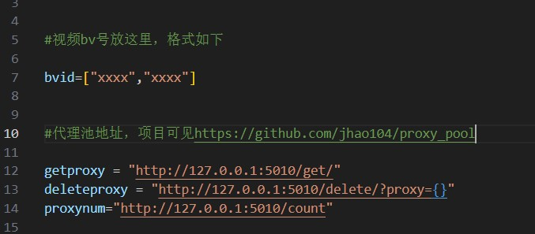
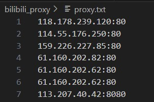

## [通过代理池刷播放量](bilibili_proxypool.py)
 

***所需安装依赖***
```python
pip install requests
```
 
**使用**：只需修改以下部分，运行即可  



## [通过现有的代理刷播放量](bilibili_proxy.py)
使用前请确保[proxy.txt](proxy.txt)中有HTTP代理

每次运行都会去除不可用代理，添加代理可直接在末尾粘贴

***所需安装依赖***
```python
pip install fake_useragent
```
```python
pip install requests
```


**代理格式**



## 免费代理
**[checkerproxy](https://checkerproxy.net/getAllProxy)**


## 代理池
[jhao104/proxy_pool](https://github.com/jhao104/proxy_pool)
